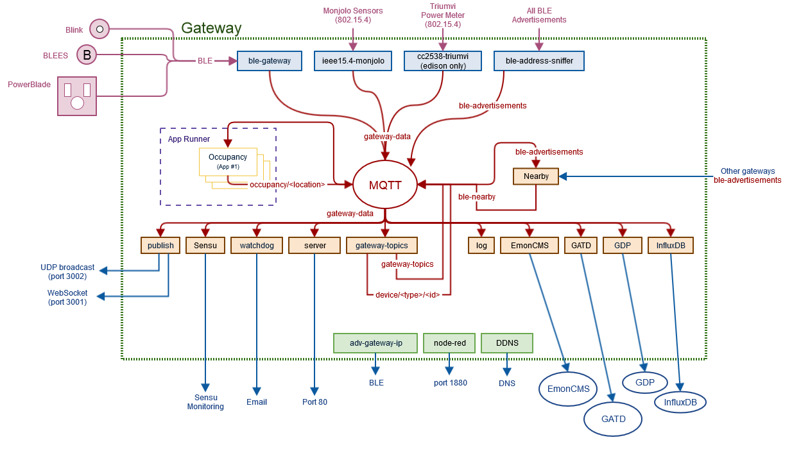

Gateway
=======

Gateways provide valuable networking, computational, and storage support for the
Internet of Things. This gateway platform is an extensible architecture that
supports multiple communication protocols, backend storage options, system
monitoring tools, and user interaction options, while enabling rapid
prototyping of new gateway services. Two core ideas underly this gateway
architecture: 1) devices should be automtically supported when in range of the gateways, and
2) data streams provided by the gateway should be easily interpretable.

This gateway provides many common services for embedded devices and sensors,
an environment for running applications local to the gateway,
and standard MQTT topics for retreiving the data streams. To promote
scalability, each node points to a method for interpreting its own data
and appending metadata. This allows the gateway to automatically adapt
to new devices without being manually configured. After devices are
discovered and their data packets are interpretted, the gateway
creates a data stream which can be published to the cloud, displayed to users,
or fed to an application.

Information
-----------

### Goals

This project has several goals:

1. Provide gateway layer functionality for a range of devices.
It should not be specific to just some projects.

2. Be as generic as possible. All device specific logic
should be developed elsewhere and pulled in only when
a relevant device is discovered.

3. Expose data streams in a low-friction manner.
This means making them available over common protocols
and in a self-describing data format.

4. Relay data streams to interested services. These could
be local to the gateway or cloud hosted endpoints.

### Software Stack

The gateway stack is a series of discrete modules linked
by MQTT. Roughly, each folder in `/software` is a
separate module.

### Parent Project

The gateway is being developed as a part of the
[Urban Heartbeat Kit Project](https://github.com/terraswarm/urban-heartbeat-kit).
More documentation on how to use a running gateway can be found there.

Super Quick Start
--------------

If you have a SwarmGateway, you can get data from it quickly. Install
[Mosquitto](https://mosquitto.org/), then:

    mosquitto_sub -h swarmgateway.local -t gateway-data

to get the full data stream. If you are not on the same network, pass `-h`
the correct IP address.

You can also see a load a status page in a web browser:
[swarmgateway.local](http://swarmgateway.local).

Related Projects
----------------

This is a list of other projects in the gateway vein. Some
have concepts that directly influenced this gateway design,
some are hardware platforms that this gateway supports, and others
just play a role in the gateway tier.

- **[IoT Gateway](https://github.com/lab11/iot-gateway)**: Leverage
smartphones to forward BLE advertisements.
- **[CloudComm](https://github.com/lab11/opo/tree/master/node)**: Eventual
data delivery to the cloud over BLE.
- **[PowerBlade](https://github.com/lab11/powerblade/tree/master/data_collection/advertisements)**:
Collect BLE advertisements from PowerBlade devices.
- **[GAP](https://github.com/lab11/gap)**: Add 802.15.4 hardware support
to the BeagleBone Black.
- **[Edison Based Gateway](https://github.com/lab11/IntelEdisonGateway)**: Gateway hardware
based on the Intel Edison.

